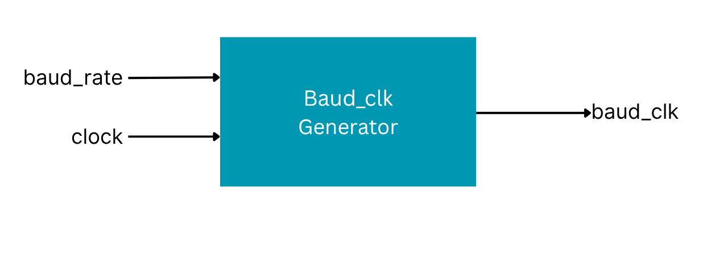
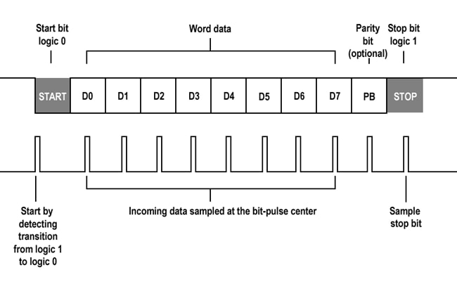
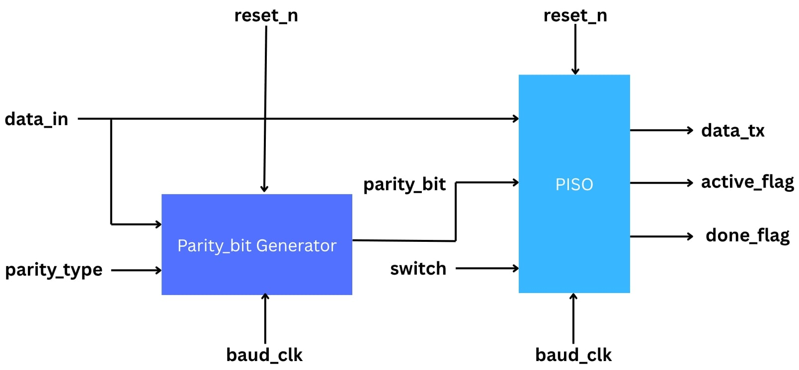
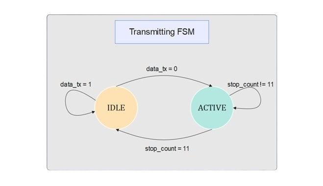
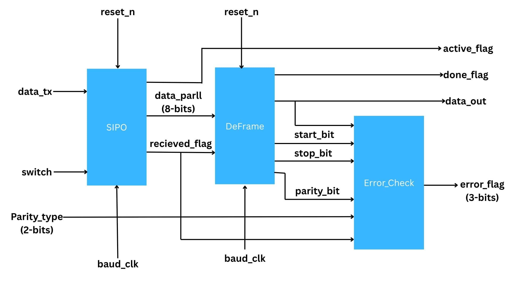
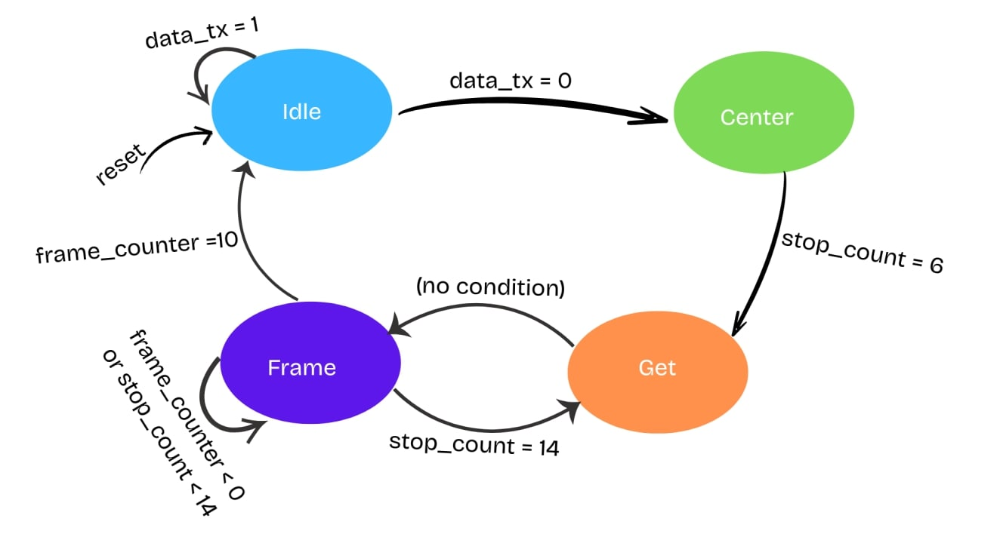

---
[UART](https://github.com/amolmunot/UART/tree/main)
---

UART stands for Universal Asynchronous Receiver/Transmitter. It's not a
communication protocol like SPI and I2C, but a physical circuit in a
microcontroller, or a stand-alone IC. A UART's main purpose is to
transmit and receive serial data.

It has 3 main circuits :- 1. Baud_clk_generator circuit

2\. transmitter circuit

3\. receiver circuit

1.Baud_clk_generator circuit :-

We know that FPGA has it's own clock which is known as system's clock ,
which is very fast , so data transimission with such a speed could lead
to bit errors and jitter, therefore to make data transfer effiecient ,
we need to slow the clock , and the slower version of clock is known as
baud_clk.

Concept :- so to slow the clock specific number of clockedge replaced by
one baud/clockedge

Formula :- bits/sec = clockfrequence/baudclock\*prefactor

There are four types of baud clock

2.transmitter circuit

It consists of 2 circuits :- 1. PISO 2. Parity_bit Generator

1.PISO has 5 inputs and 3 outputs where it takes the data which has to
be tranfered by data_in , it starts the transmission when switch is ON ,
it receives parity bit from parity_bit generator , which is useful for
error detection .

The rate of transmission is decided by baud_clk , and sudden stop of
circuit is decided by reset_n , when reset_n is 0 then no matter which
bit is being tranferrred , the system gets shut down immediately .

In PISO , in 8bit data :- start bit , parity bit and stop_bit is added
such thst it becomes 11bit frame .

Parity_bit Generator produces parity bit , when number of 1 are odd so
xor of data-in must be 1 , and paraity Type is also odd , then parity
bit is 0 else 1 similarly for parity type = EVEN

PISO has 3 outputs 1.data_tx , 2.active flag 3.done_flag

Data_tx is a serially transmitted bit one by one through PISO circuit .

Active_flag tells us whether the transmission is going on or not

Done_flag tells us whether the transmission is done or not

Here, one FSM mechanism is being followed :-

When the state is IDLE then system is in rest , when start bit arrives
,:- firstly whole transmission line is high , to start the transmission
, we have to snatch down the line from high to low using start bit.

Then it goes to active state :- where it stop count is counter which
counts upto 11 bits , when it counts upto 11 then count_full is ON , and
state changes to idle , done_flag is ON and active \_flag is OFF.

Hence the transmission part is done.

3.Receiver circuit :-

The data transferred by the transmitter circuit through data_tx wire is
received by receiver circuit serially , when switch is ON , then further
the serial data is transferred from SIPO in form of parallel data
through wire "data_parll" to deframing it .

In SIPO ,one FSm mechanism is used :-

Functions in each stage :-

1.Idle :- all the quantities become zero like :- frame_counter = 0 ,
stop_count = 0 and transmission line become inactive , therefore frame
becomes full 1 for 11 bit , because transmission line becomes on when it
is put high to low from start bit.

2.Center :- stop_count = stop +1

(the concept of using stop_count is creating a delay , delay is most
required is because

Important question :- why delay is nessecary , since we have already use
the baud_clk , which is the slower version of clk , so it provides the
system enough time to execute the process?

**🕰️ Baud Clock vs. Sampling Timing**

**✅ What you\'re thinking:**

-   \"I already have a slow baud_clk, so isn\'t that enough timing-wise
    to read bits one by one?\"

Yes, **in theory**, you could sample on every rising edge of baud_clk
--- **if** you\'re guaranteed that:

1.  The serial transmitter and receiver are **perfectly aligned**, and

2.  baud_clk edges occur **right at the center** of each bit.

But in real-world digital systems and UART-style communication, this
**alignment cannot be assumed**.

**❗ Why the delay (stop_count) is necessary:**

**1. The falling edge of the start bit is asynchronous**

-   Your FSM detects the start bit when data_tx goes from 1 → 0.

-   But this transition can occur **anywhere** with respect to your
    baud_clk edge.

-   So, if you immediately sample the next bit on the next baud_clk, you
    might be **sampling too early or too late**.

📉 *Example:* The start bit might fall right **after** a baud clock
edge. If you read the next bit 1 baud_clk later, you\'ll be sampling
**at the edge**, not center.

**2. To Sample in the Middle of a Bit**

-   For **robust data recovery**, bits are sampled **in the middle of
    their period**, where they are stable.

-   If you don\'t delay, you might sample during a transition
    (especially with noise or jitter), leading to **bit errors**.

**➤ So, even though you\'re using a baud_clk, you still need a delay
(stop_count) to:**

-   Align to the center of the **first bit** (after start)

-   Space out subsequent reads properly to **hit the center of every
    bit**

**⚠️ Without stop_count, problems may arise:**

-   If you just read on every baud_clk, and the initial detection was
    **slightly off**, every subsequent bit sample would also be **off**,
    possibly sampling during transitions.

-   Over time, this can **accumulate errors**, especially in noisy
    environments.

**✅ Conclusion: Why the Delay Is Necessary**

  -----------------------------------------------------------------------
  **🔍 Reason**              **📌 Explanation**
  -------------------------- --------------------------------------------
  Start bit detection is     It can happen anytime between baud_clk edges
  asynchronous               

  Need center sampling       Sampling at the middle of each bit reduces
                             bit errors

  Baud clock isn't perfectly You can\'t assume baud_clk edges are at the
  aligned                    center of bits

  Robustness                 Adds tolerance against jitter, clock drift,
                             and metastability
  -----------------------------------------------------------------------

So yes --- **baud_clk sets the pace**, but **stop_count aligns the
sampling point** precisely within that pace.

So , Center state positions the baud_clk edge at the centre of bit , for
errorless transfer.

3.Get :- This is the state where data from PISO is received to SIPO
through data_tx wire shifts the data one by one to the temp wire using
shift register mechanism and then immediately state changes to Frame ,
without any condition .

4.Frame:- frame_counter counts the number of bit being received by SIPO
using

frame_counter = frame_counter + 1 at every recived bit , then it creates
delay between two receiving bits using stop_count , it changes to GET
state when stop count becomes 14 , until then stop_count = stop_count +
1 , so 14 clock cylces delay is created after every bit received .

Structure look like this :-

Start bit detected

↓

Wait 6 cycles → Sample 1st data bit

↓

Wait 14 cycles → Sample 2nd data bit

↓

Wait 14 cycles → Sample 3rd data bit

\...

↓

Done → Output 11-bit data

"Deframe" circuit seperates the the start_bit , stop_bit , and
parity_bit and data from the frame . it is on when full data is received
which is detected by received_flag , after the data is separated from
the frame , done_flag is on. Hence we get transferred data through
data_out.

"Errror_Check" circuit detects the error in data using parity bit and
parity_type combination , so if the parity_bit matches the uninary xor
of data_out then hence no error , but if does not matches thhe error is
detected and error_flag is ON .

\|\| Inn this way , our data is transmitted and received

through UART and how UART works\|\|

**⚙️ UART Communication Protocol in Verilog**

**Author: Amol Munot**

Institute: NIT Rourkela

Domain: Digital Design, FSM, Serial Communication, Verilog HDL

**📌 Project Overview**

This project is a fully custom UART (Universal Asynchronous
Receiver/Transmitter) system built in Verilog HDL, showcasing a complete
Tx-Rx path including baud rate control, data conversion, frame
management, and error checking.

**🛠️ Key Modules Implemented**

1\. Baud Clock Generator -- Generates slower clock from the system
clock, adjustable for various baud rates.

2\. Transmitter (Tx) -- Uses PISO, parity bit generator, and FSM for
serial data transmission.

3\. Receiver (Rx) -- Uses SIPO and FSM with stop_count logic for
center-aligned sampling.

4\. DeFrame Unit -- Splits received frame into start, data, parity, and
stop bits.

5\. Error Check Unit -- Verifies parity, start and stop bits; raises
flags if errors occur.

**✅ Highlights**

• Designed fully from scratch using FSM-based logic

• Includes center-aligned sampling for accurate reception

• Modular, reusable design with separate testbenches

• Ready for FPGA synthesis and deployment

**🔧 How to Use**

1\. Clone the repo: https://github.com/amolmunot/UART.git

2\. Simulate using ModelSim, Vivado, or Icarus Verilog

3\. Use top modules: TxUnit.v, RxUnit.v

4\. Connect Tx to Rx via data_tx line and monitor raw_data, done_flag,
and error_flag outputs.

**👨‍💻 About Me**

Hi, I\'m Amol Munot, a passionate engineering student at NIT Rourkela.

I love working with digital logic, FPGAs, and VLSI. This UART project is
a step in mastering serial communication and Verilog-based digital
systems.

**📚 Future Enhancements**

• Add FIFO buffers between Tx and Rx

• Support variable data width and stop bits

• Interface with higher-level bus systems (e.g., AXI)

• Real-time monitoring via Python script

